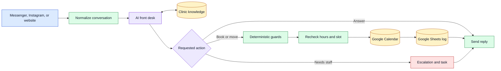

# Dental AI Front Desk

`TEMPLATE` · `OFFLINE_VERIFIED`

A reusable n8n template for handling dental-clinic messages, answering from a
clinic-owned knowledge base, and carrying confirmed booking changes into Google
Calendar and Google Sheets.

The public export is deliberately inactive. It contains example clinic details
and `REPLACE_*` placeholders, not a clinic account, patient data, or production
credentials.

## What is included

- a 78-node front-desk workflow for webhooks and text channels
- an 8-node knowledge-ingestion workflow
- deterministic booking, reschedule, cancellation, and escalation safeguards
- a Supabase pgvector schema
- offline behavior, structure, and layout tests
- setup, customization, and staff-operation guides

## How it works



The model interprets the conversation and proposes an action. Plain workflow
nodes decide whether a write is allowed. This separation keeps calendar and CRM
changes behind explicit confirmation, hours, identity, and availability checks.

## Safeguards that matter

- The requested slot is checked again immediately before a calendar write.
- A booking, move, or cancellation needs confirmation of the exact action.
- Calendar event IDs identify booking rows; phone numbers are not treated as
  unique household identifiers.
- Reschedule and cancellation lookups handle several appointments sharing one
  number without silently choosing the wrong person.
- Unsupported clinic facts are handed to staff instead of converted into a guess.
- Symptom messages are not diagnosed and medication is not prescribed.
- Calendar success is checked before the patient receives a completion message.
- Knowledge updates can be ingested and checked before an older version is removed.

## Verification

The public copy was tested on 2026-09-02:

| Check | Result |
|---|---:|
| Main workflow structure | passed, 78 nodes |
| Knowledge workflow structure | passed, 8 nodes |
| Focused behavior checks | 58 / 58 passed |
| Workflow layout checks | 11 / 11 passed |
| Export active state | inactive |
| Configuration placeholders | 12 remain by design |
| Blank-profile n8n import | 2 / 2 accepted, inactive |

This is offline verification of the public template. It is not a claim that a
reader's Meta, Google, Anthropic, OpenAI, or Supabase integration is connected or
working. See [TEST_REPORT.md](TEST_REPORT.md) and the sanitized
[import result](evidence/public_export_import_verification.json).

## Prerequisites

- Node.js 20 or later
- n8n 2.27.4 or a version you have tested for compatibility
- Anthropic for the chat model
- OpenAI for embeddings
- Supabase with pgvector for clinic knowledge
- Google Calendar, Sheets, and Gmail credentials
- a Meta app only when using Messenger or Instagram

## Quick start

1. Import the inactive workflows.

   ```bash
   n8n import:workflow --input="workflows/dental_front_desk.json"
   n8n import:workflow --input="workflows/knowledge_ingestion.json"
   ```

2. Run the offline checks.

   ```bash
   cd tools
   npm test
   ```

3. Follow [docs/SOP_SETUP.md](docs/SOP_SETUP.md), attach credentials in n8n,
   and replace every value reported by the validator.

4. Test with synthetic patient conversations and a dedicated calendar. Keep both
   workflows inactive until calendar, CRM, escalation, and privacy checks pass.

The test tools deliberately reuse Luxon from a global n8n installation so their
date behavior matches the target runtime.

## Configuration

Clinic name, hours, address, contact details, dentist, timezone, and walk-in cutoff
live together in the `Prepare Conversation State` node. A reference shape is in
[`config/clinic.example.json`](config/clinic.example.json).

Credentials belong in n8n's encrypted credential store. The optional local
knowledge-ingestion tool reads only these values from a private `.env` file:

```text
SUPABASE_URL=
SUPABASE_SERVICE_KEY=
OPENAI_API_KEY=
```

Use [`.env.example`](.env.example) as the inventory and never commit the filled
file.

## Knowledge base

[`tools/kb_ingest.mjs`](tools/kb_ingest.mjs) provides a reviewable path for PDF
knowledge updates: plan the chunks, ingest a tagged version, query it, and only
then purge the old tag. The n8n ingestion workflow remains available for teams
that prefer a watched Drive folder.

## Limitations

- This handles text messages, not phone calls.
- Appointment reminders are written as staff tasks; this template does not send
  them automatically.
- The defaults reflect a Philippine dental-clinic workflow and need localization.
- The system stores names, phone numbers, and conversation context. A deployer is
  responsible for lawful handling, retention, access control, and consent.
- AI output still needs monitoring. The deterministic guards narrow the failure
  surface but do not make the system clinically authoritative.
- No cost, conversion, response-time, or production-volume claim is included in
  this public repository.

## Repository map

- `workflows/` - inactive n8n exports
- `tools/` - validation, tests, and knowledge utilities
- `docs/` - setup, customization, and staff SOPs
- `config/` - synthetic clinic-profile example
- `supabase/` - knowledge-store schema

## License

MIT. See [LICENSE](LICENSE). Do not include real patient data in issues, pull
requests, screenshots, or test fixtures.
